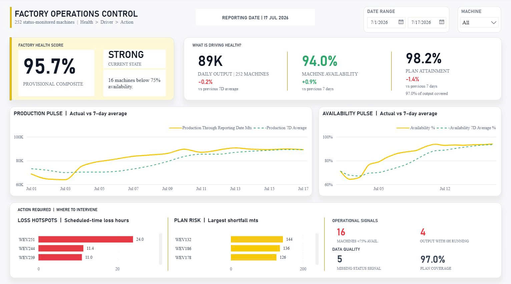

# OEE data pipeline

The workspace is split by responsibility:

- `oee-mail-downloader`: download source files.
- `oee-ingestion`: load source data into Raw.
- `oee-processing`: build Silver and Gold with dbt.
- `oee-quality`: run data quality checks.
- `oee-orchestration`: coordinate tasks with Airflow.
- `oee-dashboard`: Power BI semantic model and report.

Start-beam daily runs and backfills are defined in
`oee-orchestration/dags/oee_start_beam.py`.

See `oee-orchestration/README.md` before setting up Airflow. The local Airflow
environment runs with Docker Compose at `http://localhost:8080`.

## Dashboard

